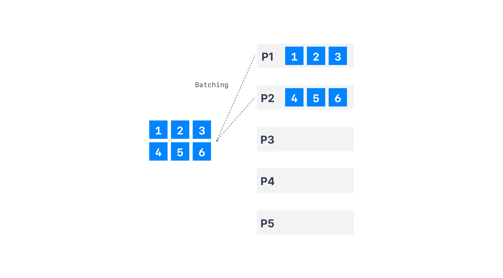
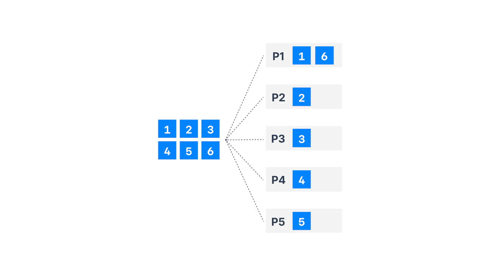

# 1. Kafka Java Project Setup Guide

This guide will walk you through setting up a Kafka project using Java, Gradle, and IntelliJ IDEA, including all necessary dependencies and initial configurations.

### Table of Contents

1. [Kafka Java Project Setup Guide](#1-kafka-java-project-setup-guide)
   1. [Prerequisites](#11-prerequisites)
   2. [Setting Up the Project](#12-setting-up-the-project)
      1. [Create a New Project in IntelliJ IDEA](#121-create-a-new-project-in-intellij-idea)
      2. [Configure Project Settings](#122-configure-project-settings)
   3. [Adding Dependencies](#13-adding-dependencies)
      1. [Configure Subprojects](#131-configure-subprojects)
      2. [Add Kafka Dependencies](#132-add-kafka-dependencies)
   4. [Final Project Setup Steps](#14-final-project-setup-steps)
   5. [Verifying the Setup](#15-verifying-the-setup)
      1. [Create a Java Class](#151-create-a-java-class)
      2. [Write and Run a Basic Java Program](#152-write-and-run-a-basic-java-program)
      3. [Configure IntelliJ IDEA for Building](#153-configure-intellij-idea-for-building)
2. [Starting Kafka and Creating a Topic](#2-starting-kafka-and-creating-a-topic)
   1. [Start Zookeeper](#21-start-zookeeper)
   2. [Start Kafka](#22-start-kafka)
   3. [Create the Kafka Topic](#23-create-the-kafka-topic)
3. [Creating Your First Kafka Producer](#3-creating-your-first-kafka-producer)
   1. [Setup Producer Properties](#31-setup-producer-properties)
   2. [Create and Configure the Producer](#32-create-and-configure-the-producer)
   3. [Send Data to Kafka](#33-send-data-to-kafka)
4. [Verifying Data Reception](#4-verifying-data-reception)
5. [Running the Producer](#5-running-the-producer)
6. [Code Overview](#6-code-overview)
7. [Implementing a Kafka Producer with Callbacks](#7-implementing-a-kafka-producer-with-callbacks)
   1. [Understanding Kafka's Sticky Partitioner](#71-understanding-kafkas-sticky-partitioner)
   2. [Code Implementation](#72-code-implementation)
   3. [Running the Callback Producer](#73-running-the-callback-producer)
8. [Kafka Producer with Keys](#8-kafka-producer-with-keys)
   1. [Sending Messages with Keys](#81-sending-messages-with-keys)
   2. [Code Implementation](#82-code-implementation)
   3. [Verifying Key-Based Partitioning](#83-verifying-key-based-partitioning)
9. [Creating Your First Kafka Consumer](#9-creating-your-first-kafka-consumer)
   1. [Setting Up the Kafka Consumer](#91-setting-up-the-kafka-consumer)
   2. [Subscribing to a Topic and Polling for Data](#92-subscribing-to-a-topic-and-polling-for-data)
   3. [Code Implementation](#93-code-implementation)
10. [Adding a Shutdown Hook to the Kafka Consumer](#10-adding-a-shutdown-hook-to-the-kafka-consumer)
1. [Setting Up a Graceful Shutdown](#101-setting-up-a-graceful-shutdown)
2. [Code Implementation](#102-code-implementation)
---

## 1.1. Prerequisites

Before starting, make sure you have the following tools installed:

- **IntelliJ IDEA Community Edition**: The development environment used in this guide.
- **Java 11 JDK**: Recommended is Amazon Corretto 11, but any Java 11 distribution should work.
- **Gradle**: Build automation tool used for managing dependencies and building the project.

## 1.2. Setting Up the Project

### 1.2.1. Create a New Project in IntelliJ IDEA

1. Open **IntelliJ IDEA**.
2. Click on **New Project**.
3. On the left-hand side, select **Gradle** as the project type.
4. Choose **Java** as the language for your Gradle project.
5. For the **Project SDK**, select the JDK you installed (e.g., **Corretto 11**).
6. Click **Next**.

### 1.2.2. Configure Project Settings

1. Name the project (e.g., `kafka-beginner`).
2. Specify a location on your computer for the project files.
3. Set the **GroupId** to `org.example`.
4. Keep the **ArtifactId** as `kafka-beginner`.
5. Set the version as `1.0-SNAPSHOT`.
6. Click **Finish** to create the project.

## 1.3. Adding Dependencies

### 1.3.1. Configure Subprojects

1. After creating the project, Gradle will synchronize the project structure.
2. **Delete** the default `src/main` and `src/test` directories. These will be replaced with subprojects.
3. Right-click on the project root (`kafka-beginner`), then select **New > Module**.
4. Select **Gradle** as the module type, choose **Java** as the language, and click **Next**.
5. Name this module `kafka-basics`, and keep the **GroupId** as `org.example`.
6. Finish setting up the module.

### 1.3.2. Add Kafka Dependencies

1. Go to the `build.gradle` file inside the `kafka-basics` module.
2. Add the following dependencies:

```gradle
dependencies {
    // https://mvnrepository.com/artifact/org.apache.kafka/kafka-clients
    implementation 'org.apache.kafka:kafka-clients:3.8.0'

    // https://mvnrepository.com/artifact/org.slf4j/slf4j-api
    implementation 'org.slf4j:slf4j-api:2.0.16'

    // https://mvnrepository.com/artifact/org.slf4j/slf4j-simple
    implementation 'org.slf4j:slf4j-simple:2.0.16'
}
```

3. **Note**: Ensure all `testImplementation` entries are changed to `implementation` if not needed.

4. Reload the Gradle project by clicking on the **Load Gradle Changes** icon or by using the **Refresh** button under the Gradle tool window.

## 1.4. Final Project Setup Steps

1. **Delete** the `src/main` and `src/test` folders in the root project if IntelliJ automatically recreated them.
2. Use only the directories within the `kafka-basics` module for your development work.
3. Ensure that all Gradle dependencies have been loaded correctly by checking the **External Libraries** section.

## 1.5. Verifying the Setup

### 1.5.1. Create a Java Class

1. Inside the `kafka-basics/src/main/java` directory, create a new package `org.example.kafka`.
2. Inside this package, create a new Java class named `ProducerDemo`.

### 1.5.2. Write and Run a Basic Java Program

1. In `ProducerDemo`, add the following code:

```java
package org.example.kafka;

public class ProducerDemo {
    public static void main(String[] args) {
        System.out.println("Hello World");
    }
}
```

2. **Run** the `ProducerDemo` class to ensure the project is correctly set up. You should see `"Hello World"` in the output window.

### 1.5.3. Configure IntelliJ IDEA for Building

1. Go to **IntelliJ IDEA > Preferences > Build, Execution, Deployment > Build Tools > Gradle**.
2. Under **Build and run using**, select **IntelliJ IDEA**.
3. Apply the changes and run the `ProducerDemo` class again to confirm everything works correctly.

---

## 2. Starting Kafka and Creating a Topic

Before running the Kafka producer, you need to start Zookeeper and Kafka, and then create the topic you'll be sending messages to.

### 2.1. Start Zookeeper

Start Zookeeper by running the following command:

```bash
zookeeper-server-start.sh ~/kafka_2.13-3.8.0/config/zookeeper.properties
```

### 2.2. Start Kafka

Once Zookeeper is running, start the Kafka broker:

```bash
kafka-server-start.sh ~/kafka_2.13-3.8.0/config/server.properties
```

### 2.3. Create the Kafka Topic

Create the topic `demo_java` where the producer will send messages:

```bash
kafka-topics.sh --bootstrap-server localhost:9092 --topic demo_java --create --partitions 3 --replication-factor 1
```

This command creates a topic named `demo_java` with 3 partitions and a replication factor of 1.

---

## 3. Creating Your First Kafka Producer

### 3.1. Setup Producer Properties

In your `ProducerDemo` class, you will first define the properties required to configure your Kafka producer. These properties include the bootstrap server and serializers for keys and values.

```java
// create Producer Properties
Properties properties = new Properties();

//connect to localhost
properties.setProperty("bootstrap.server", "127.0.0.1:9092");

// Set Producer properties
properties.setProperty("key.serializer", StringSerializer.class.getName());
properties.setProperty("value.serializer", StringSerializer.class.getName());
```

### 3.2. Create and Configure the Producer

With the properties set, you can now create and configure the Kafka producer. The producer will be responsible for sending messages to a specific Kafka topic.

```java
// create the Producer
KafkaProducer<String, String> producer = new KafkaProducer<>(properties);
```

### 3.3. Send Data to Kafka

Create a producer record that contains the topic name and the message you want to send. Then, use the producer to send this record to the Kafka broker.

```java
// create a Producer Record
ProducerRecord<String, String> producerRecord =
        new ProducerRecord<>("demo_java", "hello from demo_java topic");

// send data
producer.send(producerRecord);

//  flush: tell the producer to send all data and block until done --synchronous
producer.flush();

// close the producer
producer.close();
```

---

## 4. Verifying Data Reception

To confirm that the data was successfully sent to Kafka, you can use a Kafka Console Consumer. Open a terminal and run the following command:

```bash
kafka-console-consumer.sh --bootstrap-server 127.0.0.1:9092 --topic demo_java --from-beginning
```

This command will display all messages sent to the `demo_java` topic, including the `"hello from demo_java topic"` message you sent using your producer.

---

## 5. Running the Producer

1. Ensure that your Kafka broker is running on `localhost:9092`.
2. Run the `ProducerDemo` class from IntelliJ IDEA.
3. Check the terminal where your Kafka Console Consumer is

running to verify that the message has been received.

---

## 6. Code Overview

Here is the complete code for your `ProducerDemo` class:

```java
package org.example.kafka;

import org.apache.kafka.clients.producer.KafkaProducer;
import org.apache.kafka.clients.producer.ProducerRecord;
import org.apache.kafka.common.serialization.StringSerializer;
import org.slf4j.Logger;
import org.slf4j.LoggerFactory;

import java.util.Properties;

public class ProducerDemo {

   private static final Logger log = LoggerFactory.getLogger(ProducerDemo.class.getSimpleName());
   public static void main(String[] args) {
      log.info("Hello world");

      // create Producer Properties
      Properties properties = new Properties();

      //connect to localhost
      properties.setProperty("bootstrap.servers", "127.0.0.1:9092");

      //connect to Conduktor playground
//        properties.setProperty("bootstrap.server", "cluster.playground.cdkt.io:9092");
//        properties.setProperty("security.protocol", "SASL_SSL");
//        properties.setProperty("sasl.jaas.config", "org.apache.kafka.common.security.plain.PlainLoginModule required  username=\"alice\" password=\"alice-secret\";");
//        properties.setProperty("sasl.mechanism", "PLAIN");


      // set Producer properties
      properties.setProperty("key.serializer", StringSerializer.class.getName());
      properties.setProperty("value.serializer", StringSerializer.class.getName());

      // create the Producer
      KafkaProducer<String, String> producer = new KafkaProducer<>(properties);

      // create a Producer Record
      ProducerRecord<String, String> producerRecord =
              new ProducerRecord<>("demo_java", "hello from demo_java topic");

      // send data
      producer.send(producerRecord);


      //  flush: tell the producer to send all data and block until done --synchronous
      producer.flush();

      // close the producer
      producer.close();
   }
}
```

#### 7. Implementing a Kafka Producer with Callbacks

### 7.1. Understanding Kafka's Sticky Partitioner

When producing messages to Kafka, you can use a callback mechanism to confirm whether the message was successfully sent and to which partition and offset it was sent. Additionally, Kafka's producer uses a feature called the **Sticky Partitioner** to improve performance by batching messages that are sent in quick succession to the same partition.

Here’s a visual representation of how the **Sticky Partitioner** works compared to the **RoundRobin Partitioner**:

**Sticky Partitioner:**


**RoundRobin Partitioner:**



### 7.2. Code Implementation

Below is the code for implementing a Kafka producer with callbacks to demonstrate the Sticky Partitioner:

```java
package org.example.kafka;

import org.apache.kafka.clients.producer.*;
import org.apache.kafka.common.serialization.StringSerializer;
import org.slf4j.Logger;
import org.slf4j.LoggerFactory;

import java.util.Properties;

public class ProducerDemoWithCallback {

    private static final Logger log = LoggerFactory.getLogger(ProducerDemoWithCallback.class.getSimpleName());

    public static void main(String[] args) {
        log.info("I'm a Kafka Producer!");

        // create Producer Properties
        Properties properties = new Properties();

        //connect to localhost
        properties.setProperty("bootstrap.servers", "127.0.0.1:9092");

        //connect to Conduktor playground
//        properties.setProperty("bootstrap.servers", "cluster.playground.cdkt.io:9092");
//        properties.setProperty("security.protocol", "SASL_SSL");
//        properties.setProperty("sasl.jaas.config", "org.apache.kafka.common.security.plain.PlainLoginModule required username=\"alice\" password=\"alice-secret\";");
//        properties.setProperty("sasl.mechanism", "PLAIN");

        // set Producer properties
        properties.setProperty("key.serializer", StringSerializer.class.getName());
        properties.setProperty("value.serializer", StringSerializer.class.getName());
        properties.setProperty("batch.size", "400");

        // Uncomment the following line to use RoundRobinPartitioner instead of the default Sticky Partitioner
        // properties.setProperty("partitioner.class", RoundRobinPartitioner.class.getName());

        // create the Producer
        KafkaProducer<String, String> producer = new KafkaProducer<>(properties);

        for (int j = 0; j < 10; j++) {
            for (int i = 0; i < 30; i++) {
                // create a Producer Record
                ProducerRecord<String, String> producerRecord =
                        new ProducerRecord<>("demo_java", "hello from demo_java topic " + i);

                // send data
                producer.send(producerRecord, new Callback() {
                    @Override
                    public void onCompletion(RecordMetadata metadata, Exception e) {
                        // this will be executed every time a record was successfully sent or an exception is thrown
                        if (e == null) {
                            // the record was successfully sent
                            log.info("Received new metadata \n" +
                                    "Topic: " + metadata.topic() + "\n" +
                                    "Partition: " + metadata.partition() + "\n" +
                                    "Offset: " + metadata.offset() + "\n" +
                                    "Timestamp: " + metadata.timestamp() + "\n");
                        } else {
                            log.error("Error while producing", e);
                        }
                    }
                });

                try {
                    Thread.sleep(500);
                } catch (InterruptedException e) {
                    throw new RuntimeException(e);
                }
            }
        }

        // flush: tell the producer to send all data and block until done -- synchronous
        producer.flush();

        // close the producer
        producer.close();
    }
}
```

### 7.3. Running the Callback Producer

To run this code, follow these steps:

1. **Start Zookeeper** and **Kafka** as described in section 2.
2. **Create the topic** `demo_java` if not already created.
3. **Run the `ProducerDemoWithCallback`** class from IntelliJ IDEA.
4. **Monitor the output** to see which partitions the messages are sent to and verify the Sticky Partitioner behavior.

## 8. Kafka Producer with Keys

### 8.1. Sending Messages with Keys

In Kafka, when you send messages with non-null keys, those messages with the same key are consistently routed to the same partition. This behavior is particularly useful when you need ordering guarantees for messages with the same key.

### 8.2. Code Implementation

Here is the code for a Kafka producer that sends messages with keys:

```java
package org.example.kafka;

import org.apache.kafka.clients.producer.Callback;
import org.apache.kafka.clients.producer.KafkaProducer;
import org.apache.kafka.clients.producer.ProducerRecord;
import org.apache.kafka.clients.producer.RecordMetadata;
import org.apache.kafka.common.serialization.StringSerializer;
import org.slf4j.Logger;
import org.slf4j.LoggerFactory;

import java.util.Properties;

public class ProducerDemoKeys {

    private static final Logger log = LoggerFactory.getLogger(ProducerDemoKeys.class.getSimpleName());
    public static void main(String[] args) {
        log.info("I'm a Kafka Producer!");

        // create Producer Properties
        Properties properties = new Properties();

        //connect to localhost
        properties.setProperty("bootstrap.servers", "127.0.0.1:9092");

        //connect to Conduktor playground
//        properties.setProperty("bootstrap.server", "cluster.playground.cdkt.io:9092");
//        properties.setProperty("security.protocol", "SASL_SSL");
//        properties.setProperty("sasl.jaas.config", "org.apache.kafka.common.security.plain.PlainLoginModule required username=\"alice\" password=\"alice-secret\";");
//        properties.setProperty("sasl.mechanism", "PLAIN");

        // set Producer properties
        properties.setProperty("key.serializer", StringSerializer.class.getName());
        properties.setProperty("value.serializer", StringSerializer.class.getName());

        // create the Producer
        KafkaProducer<String, String> producer = new KafkaProducer<>(properties);

        for (int j = 0; j < 2; j++) {
            for (int i = 0; i < 10; i++) {

                String topic = "demo_java";
                String key = "id_" + i;
                String value = "hello from demo_java topic " + i;

                // create a Producer Record
                ProducerRecord<String, String> producerRecord =
                        new ProducerRecord<>(topic, key, value);

                // send data
                producer.send(producerRecord, new Callback() {
                    @Override
                    public void onCompletion(RecordMetadata metadata, Exception e) {
                        // this will be executed every time a record was successfully sent or an exception is thrown
                        if (e == null) {
                            // the record was successfully sent
                            log.info("Key: " + key + " | Partition: " + metadata.partition());
                        } else {
                            log.error("Error while producing", e);
                        }
                    }
                });
            }

            try {
                Thread.sleep(500);
            } catch (InterruptedException e) {
                throw new RuntimeException(e);
            }
        }

        // flush: tell the producer to send all data and block until done -- synchronous
        producer.flush();

        // close the producer
        producer.close();
    }
}
```

### 8.3. Verifying Key-Based Partitioning

When you run this code, you will notice that messages with the same key are consistently sent to the same partition. This is a crucial feature for maintaining message order when processing data in Kafka.

To observe this behavior, run the `ProducerDemoKeys` class and check the console output. You should see that the same keys always go to the same partition, as illustrated by the log messages.


## 9. Creating Your First Kafka Consumer

### 9.1. Setting Up the Kafka Consumer

In this section, we will write a Kafka consumer using the Java API to receive messages from Kafka. We'll go over basic configuration parameters and confirm that our consumer receives data from the Kafka producer we wrote earlier.

To start, create a new Java class called `ConsumerDemo`:

```java
package org.example.kafka;

import org.apache.kafka.clients.consumer.ConsumerRecord;
import org.apache.kafka.clients.consumer.ConsumerRecords;
import org.apache.kafka.clients.consumer.KafkaConsumer;
import org.apache.kafka.clients.producer.KafkaProducer;
import org.apache.kafka.clients.producer.ProducerRecord;
import org.apache.kafka.common.serialization.StringDeserializer;
import org.apache.kafka.common.serialization.StringSerializer;
import org.slf4j.Logger;
import org.slf4j.LoggerFactory;

import java.time.Duration;
import java.util.Arrays;
import java.util.Properties;

public class ConsumerDemo {

   private static final Logger log = LoggerFactory.getLogger(ConsumerDemo.class.getSimpleName());
   public static void main(String[] args) {
      log.info("I'm a Kafka Consumer!");

      String groupId = "my-java-application";
      String topic = "demo_java";

      // create Consumer Properties
      Properties properties = new Properties();

      //connect to localhost
      properties.setProperty("bootstrap.servers", "127.0.0.1:9092");

      // create consumer properties
      properties.setProperty("key.deserializer", StringDeserializer.class.getName());
      properties.setProperty("value.deserializer", StringDeserializer.class.getName());

      properties.setProperty("group.id", groupId);

      properties.setProperty("auto.offset.reset", "earliest"); // Earliest means read from the beginning of my topic. This corresponds to --beginning option in kafka cli
//      properties.setProperty("auto.offset.reset", "none"); // None means that if we don't have any existing consumer group, then we fail. That means that we must set the consumer group before starting the application
//      properties.setProperty("auto.offset.reset", "latest"); //  Read from just now and only read the new messages sent from now.

      // create a consumer
      KafkaConsumer<String, String> consumer = new KafkaConsumer<>(properties);

      // subscribe to a topic
      consumer.subscribe(Arrays.asList(topic));

      // poll for data
      while (true){

         log.info("Polling");
         ConsumerRecords<String, String> records = consumer.poll(Duration.ofMillis(1000));

         for (ConsumerRecord<String, String> record: records){
            log.info("Key: "+ record.key() + ", Value: " + record.value());
            log.info("Partition: "+ record.partition() + ", Offset: " + record.offset());
         }
      }
   }
}
```

### 9.2. Subscribing to a Topic and Polling for Data

In the above code, the consumer is configured to connect to Kafka running on `localhost:9092` and is set to consume from the `demo_java` topic. The consumer will poll Kafka every second, waiting for any new data.

We configured the consumer with the following properties:

- **bootstrap.servers**: The Kafka broker address.
- **key.deserializer** and **value.deserializer**: These are used to deserialize the messages' keys and values, respectively.
- **group.id**: The consumer group ID, which allows multiple consumers to share the load.
- **auto.offset.reset**: Configured to `earliest` to ensure the consumer reads from the beginning of the topic if there are no committed offsets.

### 9.3. Code Implementation

This consumer is set up to continuously poll Kafka and log any incoming messages. It will display the key, value, partition, and offset for each message it consumes. This setup ensures that your consumer is always ready to process incoming messages from the `demo_java` topic.

By running this consumer, you can observe the messages produced by your Kafka producer in real-time.

## 10. Adding a Shutdown Hook to the Kafka Consumer

### 10.1. Setting Up a Graceful Shutdown

In this section, we'll enhance our Kafka consumer to handle shutdowns gracefully. This involves adding a shutdown hook that ensures the consumer closes properly, commits offsets, and leaves the consumer group gracefully. This is crucial in real-world applications to avoid leaving the consumer group in an inconsistent state.

To begin, we'll duplicate our `ConsumerDemo` class and modify it to include a shutdown hook.

### 10.2. Code Implementation

Here is the updated code for `ConsumerDemoWithShutdown`:

```java
package org.example.kafka;

import org.apache.kafka.clients.consumer.ConsumerRecord;
import org.apache.kafka.clients.consumer.ConsumerRecords;
import org.apache.kafka.clients.consumer.KafkaConsumer;
import org.apache.kafka.common.errors.WakeupException;
import org.apache.kafka.common.serialization.StringDeserializer;
import org.slf4j.Logger;
import org.slf4j.LoggerFactory;

import java.time.Duration;
import java.util.Arrays;
import java.util.Properties;

public class ConsumerDemoWithShutdown {

    private static final Logger log = LoggerFactory.getLogger(ConsumerDemoWithShutdown.class.getSimpleName());
    public static void main(String[] args) {
        log.info("I'm a Kafka Consumer!");

        String groupId = "my-java-application";
        String topic = "demo_java";

        // create Consumer Properties
        Properties properties = new Properties();

        //connect to localhost
        properties.setProperty("bootstrap.servers", "127.0.0.1:9092");

        // create consumer properties
        properties.setProperty("key.deserializer", StringDeserializer.class.getName());
        properties.setProperty("value.deserializer", StringDeserializer.class.getName());

        properties.setProperty("group.id", groupId);
        properties.setProperty("auto.offset.reset", "earliest");

        // create a consumer
        KafkaConsumer<String, String> consumer = new KafkaConsumer<>(properties);

        // get a reference to the main thread
        final  Thread mainThread = Thread.currentThread();

        // adding the shutdown hook
        Runtime.getRuntime().addShutdownHook(new Thread(){
            public void run() {
                log.info("Detected a shutdown, let's exit by calling consumer.wakeup()...");
                consumer.wakeup();

                // join the main thread to allow the execution of the code in the main thread
                try {
                    mainThread.join();
                } catch (InterruptedException e) {
                    throw new RuntimeException(e);
                }
            }
        });

        try {
            // subscribe to a topic
            consumer.subscribe(Arrays.asList(topic));

            // poll for data
            while (true) {

                log.info("Polling");
                ConsumerRecords<String, String> records = consumer.poll(Duration.ofMillis(1000));

                for (ConsumerRecord<String, String> record : records) {
                    log.info("Key: " + record.key() + ", Value: " + record.value());
                    log.info("Partition: " + record.partition() + ", Offset: " + record.offset());
                }
            }
        }catch (WakeupException e) {
            log.info("Consumer is starting to shut down...");
        }catch (Exception e) {
            log.info("Unexpected exception in the consumer", e);
        } finally {
            consumer.close(); // close the consumer and commit the offsets
            log.info("The consumer is now gracefully shut down");
        }
    }
}
```

### Explanation:

- **Main Thread Reference**: We get a reference to the main thread of the program to ensure that the shutdown hook can properly join and allow the program to close gracefully.

- **Shutdown Hook**: We add a shutdown hook that triggers when the JVM shuts down. This hook calls `consumer.wakeup()` to interrupt any ongoing polling and gracefully shuts down the consumer.

- **Try-Catch Block**: The `consumer.poll()` is enclosed in a try-catch block to handle the `WakeupException`, which is expected during shutdown. Any other exceptions are logged as errors.

- **Finally Block**: This block ensures that the consumer is properly closed and offsets are committed, even if an unexpected exception occurs.

### Running the Consumer with Shutdown Hook

When you run the `ConsumerDemoWithShutdown` class, the consumer will start normally and poll for data. If you terminate the application (e.g., by stopping it in your IDE or pressing Ctrl+C in the terminal), the shutdown hook will ensure that the consumer exits cleanly, commits offsets, and leaves the consumer group gracefully.